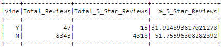

# Amazon_Vine_Analysis

## Purpose

The purpose of this analysis was to determine positivity bias in amazon reviews from people that were being paid to review products by Vine.
PySpark was used to extract, transform, and load data from an Amazon S3 bucket to pgAdmin using an AWS RDS instance.
PySpark was then used to determine positivity bias from Vine members

## Results

### Vine Reviews
- The total Vine reviews were 47
- 15 of the 47 reviews were 5-stars
- 31.91% of the reviews were 5-stars

### Non-Vine Reviews
- The total non-Vine reviews are 8343
- 4318 of the 8343 reviews were 5-stars
- 51.76% of the reviews were 5-stars

## Summary

Based on the percentage data gathered, I would conclude that there is no positivity bias in the Vine program. 
The percent of 5-stars from Vine reviews is about 20% less than those from Non-Vine reviews.

However, looking at the data overall, I would conclude that the sample size of Vine review data is not large enough to be comparable with the Non-Vine review data.

### Further Analysis

For further analysis, I would perform the same calculations for 1, 2, 3, and 4 star reviews.
